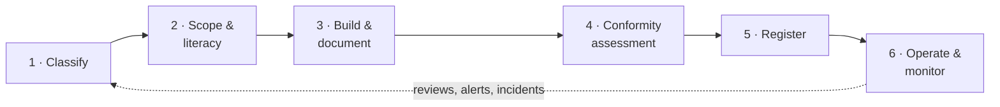

# Veritome

**Classify, document, and track your EU AI Act obligations — system by system, article by article.**

Enterprise-grade compliance depth for European SMEs, at a transparent self-serve price.
Built in Europe · Hosted in Europe · GDPR-native · **Launching September 2026**

[veritome.eu](https://veritome.eu) · [Trust Center](https://veritome.eu/trust) · [Handbook](https://veritome.eu/handbook) · [Free readiness check](https://veritome.eu/apps/readiness-assessment)

> This is the public overview of **Veritome** by Relay Labs. The application itself is
> developed in a private repository — for early access ahead of launch, start with the
> [free readiness assessment](https://veritome.eu/apps/readiness-assessment) or
> [get in touch](https://veritome.eu/contact).

---

## Why Veritome

The EU AI Act (Regulation (EU) 2024/1689) is the longest regulation Europe has ever
written — 113 articles, 13 annexes, and fines of up to €35M or 7% of global turnover.
Veritome turns it into a **guided, trackable workflow**: register each AI system,
classify it against the Act's exact logic, auto-map the obligations that actually
apply, generate audit-ready documentation, and hand a regulator a hash-sealed dossier
with a public verification URL.

Built for the **deployers, providers, importers and distributors** at European SMEs —
and the in-house counsel and advisors who support them — who feel the fine exposure
but can't justify a six-figure enterprise GRC contract.

- **Built for the regulation, not around it** — classification mirrors the Act's own branching logic (prohibited practices → Annex I product route → Annex III domains → Article 6(3) exceptions → role), and every obligation lands on a specific article with a deadline derived from the Act, not guessed.
- **A living cycle, not a one-off** — automated review schedules, evidence-expiry alerts, incident timers and a compliance calendar keep the file current long after the first pass.
- **Verifiable output** — Annex IV technical files, fundamental-rights impact assessments and Declarations of Conformity assemble from live data, are timestamped and hash-sealed, and carry a public verify URL a regulator can check without an account.
- **EU-sovereign by default** — EU hosting, EU AI processing, GDPR-native, and no US sub-processors for compliance-critical data.
- **AI literacy built in** — role-based Article 4 training programmes with verifiable certificates.

---

## The compliance journey

Every AI system walks the same gated, six-phase journey — each phase unlocks the next,
and every obligation is tied to its article with a deadline derived from the Act.

| # | Phase | What happens |
|---|-------|--------------|
| 1 | **Classify** | Branching wizard to risk tier, role and Annex III domain — prohibited-practice screening (Art. 5) first. |
| 2 | **Scope & literacy** | Staff AI literacy (Art. 4), instructions-for-use receipt, scope confirmation. |
| 3 | **Build & document** | Risk management (Art. 9), data governance (Art. 10), human oversight (Art. 14). |
| 4 | **Conformity assessment** | Fundamental-rights impact assessment (Art. 27), conformity route (Art. 43), CE readiness. |
| 5 | **Register** | EU database / Annex VIII registration export (Art. 49). |
| 6 | **Operate & monitor** | Transparency (Art. 50), post-market monitoring (Art. 72), incident reporting (Art. 73). |

---

## Feature highlights

**AI system register & guided classification**
Inventory every AI tool with its role, vendor and purpose. A guided decision tree
follows the Act's own flowchart with every branch anchored to an article;
re-classification is a diff, not a reset, with a full classification audit trail.

**Obligations workbench**
The obligation set for each system is generated automatically from its classification
and managed on a kanban board — article-derived deadlines, assignees, and evidence
attached at item level.

**Risk, incidents & reviews**
An Article 9 risk register with inherent/residual scoring and sign-off; a
serious-incident log with tiered reporting deadlines; review schedules and
evidence-expiry alerts on a compliance calendar.

**Documents that prove it**
Annex IV technical files, FRIAs and Declarations of Conformity assembled from live
data — timestamped, hash-sealed, and publicly verifiable. An evidence map groups
files by fingerprint so one document can satisfy multiple controls.

**Aria — regulatory AI assistant**
An EU-hosted assistant that analyses systems against the Act, proposes
classifications with article references, spots evidence gaps and drafts
documentation. Your data never leaves the EU and is contractually excluded from
AI training.

**AI literacy & certificates**
Role-based Article 4 training programmes with an organisation-wide literacy score
and verifiable completion certificates.

**Reports**
Board summaries, audit-prep packs, incident registers, CE-readiness reports and
per-system audit bundles — generated as polished PDFs.

---

## Technology & trust

| | |
|---|---|
| Platform | Modern web application (Next.js / TypeScript / PostgreSQL) — fast, dependable, continuously tested |
| Data residency | Application, database and file storage hosted in the EU (Germany); AI processing in the EU (France) |
| Sovereignty | No US sub-processors for compliance-critical data; AI training use contractually excluded |
| Security | AES-256 at rest, TLS 1.3 in transit, role-based access, rate limiting, hardened security headers |
| Integrity | SHA-256 hash-sealed documents and certificates with public verification URLs |
| Disclosure | Published SBOM and vulnerability-disclosure policy — report privately to security@veritome.eu |

Full details in the live [Trust Center](https://veritome.eu/trust).

---

## Roadmap

**Veritome Academy** — free public AI-literacy training with certificates, open to everyone.

**Multi-framework packs** — extending the same obligation spine to GDPR, NIS2 and DORA.

**Deeper regulatory automation** — a single regulatory registry driving every citation
and date across the product, training content and documentation, so regulatory facts
can never drift.

---

## About

Veritome is built by **Relay Labs** (Dublin, Ireland) and launches **September 2026**,
with a founding-members programme open ahead of launch.

**[veritome.eu](https://veritome.eu)** · [Free readiness check](https://veritome.eu/apps/readiness-assessment) · [Contact](https://veritome.eu/contact)

---

© 2026 Relay Labs Ltd — Dublin. All rights reserved. Veritome is proprietary software; this overview is provided for information only and grants no rights to the software.
